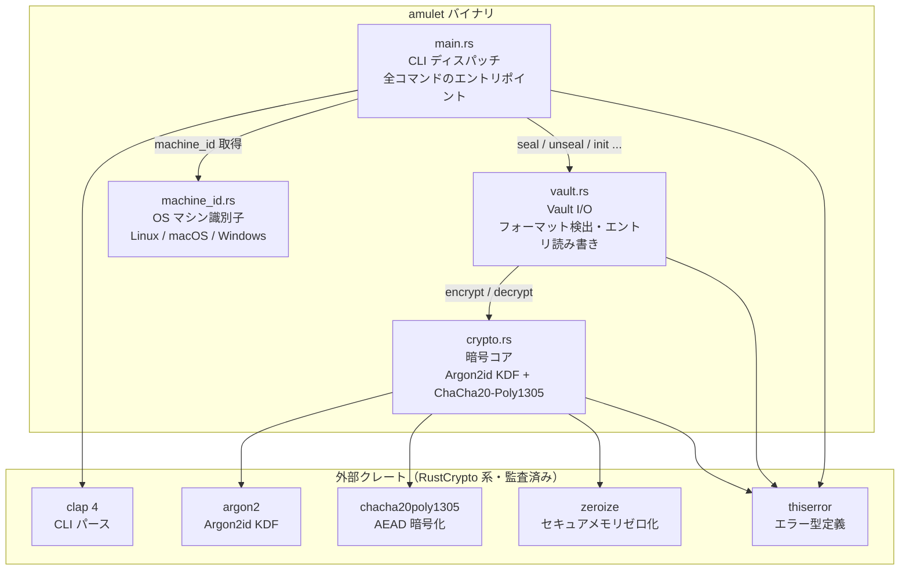
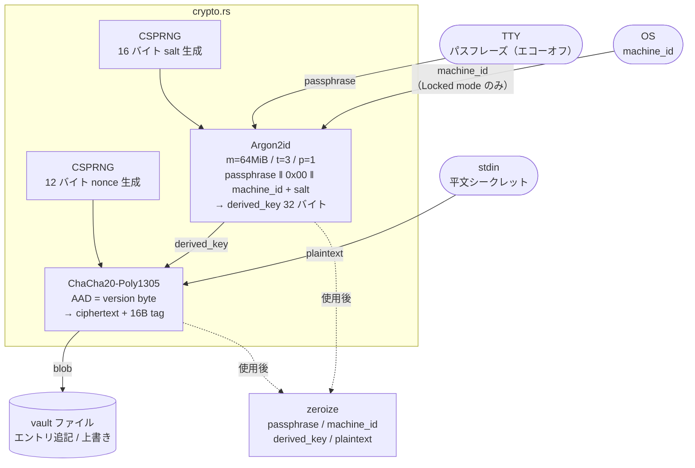
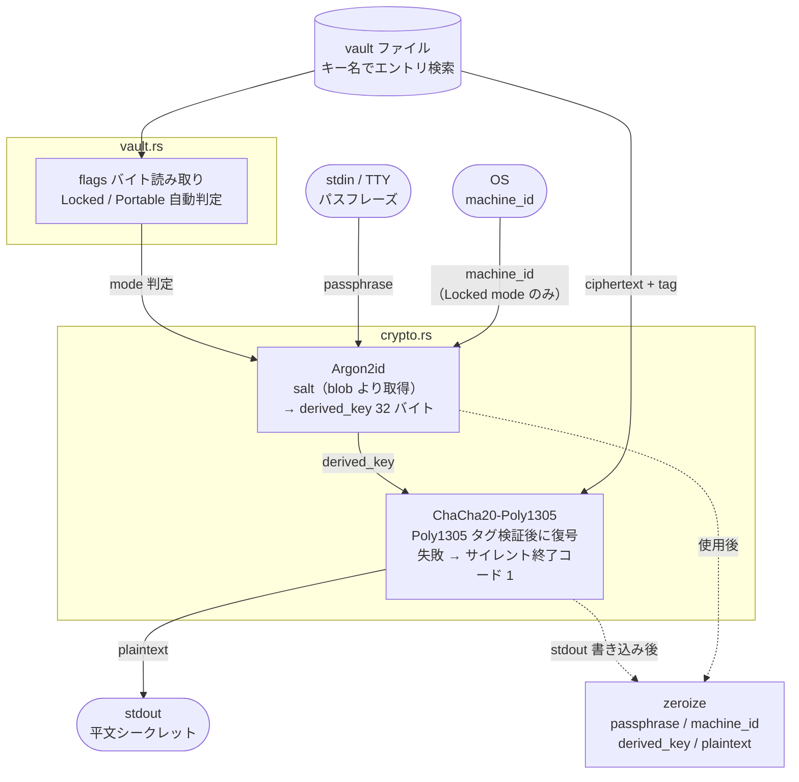
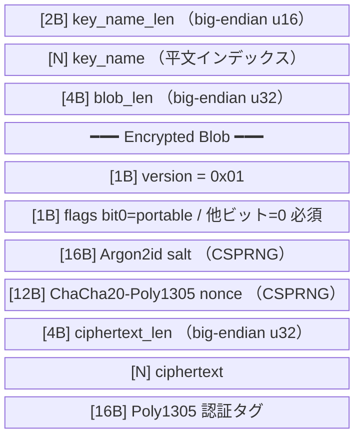
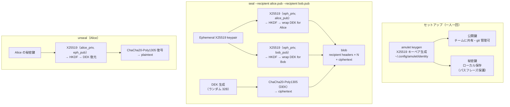
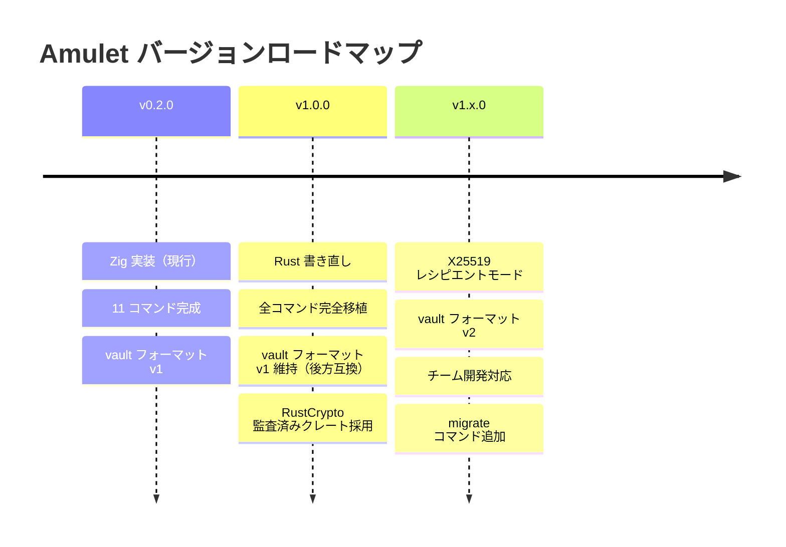

# Amulet — アーキテクチャ設計

> このドキュメントは Rust 書き直し（v1.0）および将来のチーム機能（v1.x）の設計基盤です。

---

## 1. モジュール構成

**設計方針:**
- `main.rs` が machine_id を取得し、vault 操作に渡す（Zig 版と同じ責務分離）
- `crypto.rs` は pure 関数のみ。副作用なし
- `vault.rs` はフォーマット検出・I/O のみ。暗号知識を持たない
- `machine_id.rs` は他モジュールに依存しない

---

## 2. seal データフロー

---

## 3. unseal データフロー

---

## 4. vault バイナリフォーマット（v1 — 現行・後方互換対象）

**ファイル全体:** エントリの連続。先頭にグローバルヘッダなし。0 バイトの空ファイル = 空 vault。

---

## 5. 将来設計 — v1.x レシピエントモード（公開鍵チーム共有）

> v1.0 には含まない。vault フォーマット v2 として追加予定。

**v1.x で追加するコマンド:**

| コマンド | 概要 |
|---------|------|
| `amulet keygen` | X25519 キーペアを生成・保存 |
| `amulet seal --recipient <pubkey>` | 1人以上のレシピエントへ seal |
| `amulet add-recipient <pubkey> <key>` | 既存エントリに受取人を追加 |
| `amulet remove-recipient <pubkey> <key>` | 受取人を削除（退職時など） |

**共有パスフレーズが不要になる。** 各自の秘密鍵は自分のパスフレーズで保護。メンバーが抜けても他メンバーの鍵は安全なまま。

---

## バージョンロードマップ

