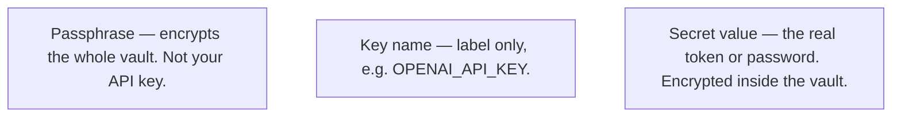
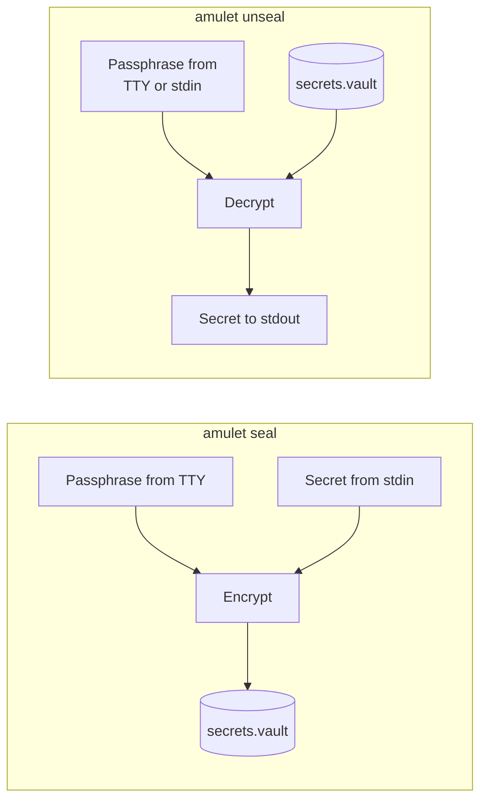

# Amulet — Hardware-Bound, Zero-Trace Secret Manager

## Overview

Amulet is a CLI tool that encrypts secrets (API keys, tokens, passwords, etc.) and binds them to a **specific physical machine**.

- Do not keep secrets in a `.env` file — store them in an encrypted vault file instead.
- Secret **values** are not passed as command-line flags or carried in normal environment variables; commands read them from piped input where needed.
- If decryption fails, the program exits with a failure status and prints **no** error message (this is intentional).
- The design reduces accidental leaks to AI coding assistants and other tools.

**Words used above (quick reference):** **argv** = arguments typed after the command name (Amulet keeps secrets off the command line). **stdin** = input piped or typed into a program — secret values for `seal` come from here. **Exit code 1** = the shell’s usual “something failed” status; Amulet intentionally prints no error details when decryption fails.

**Terminal I/O in plain language (stdin, stdout, pipes, `>` / `<`, PowerShell vs bash vs cmd):** [Standard input and output](docs/getting-started.md#standard-input-and-output-stdin-stdout-stderr) · [Redirection and Windows shells](docs/getting-started.md#beyond-pipes-redirection-and-windows-shells).

---

## Scope and limits

Amulet targets **everyday developer workflows** and reduces **accidental** exposure (for example: committing a `.env`, assistants reading files in the repo, or putting secrets in `argv`). It is **not** a replacement for team-wide secret platforms (Infisical, cloud KMS, etc.).

**Threat model:** If the **OS is already compromised** or **malware controls your terminal** (including what reaches stdin), no CLI can fully protect you — that is outside Amulet’s scope.

**No bulk plaintext export:** There is **no** command to dump every secret to a file at once. That would be a large footgun. For backup and recovery, follow [Migration, multi-device, and disaster recovery](#migration-multi-device-and-disaster-recovery): copy **ciphertext** vault files where appropriate, use **Portable** mode when you need cross-machine recovery with only a passphrase, or keep recovery material in a **password manager** and **re-seal** on a new machine.

---

## If you are new here

**In short:** Amulet keeps API keys and similar secrets inside an encrypted **vault file** (for example `secrets.vault`). You choose a **passphrase** that protects the file. You **seal** to store a secret under a **key name**, and **unseal** to read it back. In **Locked Mode** (the default), decryption only works on the **same machine** that wrote the entry.

| Term | Meaning |
|------|---------|
| **Vault** | Encrypted file on disk (`*.vault`). You can commit it to git; it does not contain plaintext secrets. |
| **Key name** | A label inside the vault (e.g. `OPENAI_API_KEY`). It is **not** the secret value. |
| **Passphrase** | A password **you** choose when sealing. You need the same passphrase to unseal. **If you lose it, the ciphertext alone is not enough to recover secrets.** |
| **Seal / unseal** | **Seal** = write a secret into the vault. **Unseal** = read it (to stdout, or inside your app via the Node helper). |
| **stdout** | Normal program output (what you see in the terminal). `unseal` writes the decrypted secret here. |

**Diagrams** (GitHub renders these automatically):

*What is what — do not mix these up:*



*Where each input goes (typical CLI paths):*



**Suggested reading order:** [Getting started (terminal basics)](docs/getting-started.md) (optional) → [Installation](#installation) → [Quick Start](#quick-start-vibe-coding--ai-assisted-development) → [Modes](#modes) if you use more than one computer → [CLI Usage](#cli-usage) for every flag and edge case.

---

## Why Amulet?

Tools like Infisical, HashiCorp Vault, and AWS Secrets Manager excel at team sharing, audit logs, and fine-grained access control — but they come with server setup and operational overhead.

Amulet is the opposite.

| | Existing secret management platforms | Amulet |
|---|---|---|
| Setup | Server or cloud account required | Single binary |
| Team sharing | ✅ Great | ❌ Out of scope (single-machine) |
| Network dependency | Yes | None (fully local) |
| Hardware binding | No | ✅ Locked Mode |
| AI agent protection | Indirect | Structurally designed in |

**Amulet is a good fit if you:**
- Are a solo developer, freelancer, or one-person team
- Want secrets to stay local without running a server
- Use AI agents or vibe coding and want structural protection against secret leakage
- Want something lightweight you can start using immediately

**Amulet is not the right tool if you:**
- Need to share secrets across a team → consider Infisical or Vault
- Work primarily in CI/container environments → combine with your cloud provider's Secrets Manager

---

## Installation

> **Prerequisites:** familiarity with running commands in a terminal and basic file path handling. **New to the terminal?** See [Getting started: terminal, PATH, and environment variables](docs/getting-started.md).

Download the latest binary from [GitHub Releases](https://github.com/Tuki-Sana/amulet/releases):

| OS | File |
|---|---|
| Linux (x86_64) | `amulet-linux-x86_64` |
| macOS (Apple Silicon) | `amulet-macos-aarch64` |
| macOS (Intel) | `amulet-macos-x86_64` |
| Windows (x86_64) | `amulet-windows-x86_64.exe` |

**Linux / macOS:** use the **file name you downloaded** from the table (do not copy blindly if you are on Apple Silicon vs Intel, etc.):

```sh
chmod +x ./amulet-macos-aarch64
sudo mv ./amulet-macos-aarch64 /usr/local/bin/amulet
```

Then run `amulet version` — release builds print the git tag (for example `v0.1.0`); local builds without `-Dversion` show `0.0.0-dev`.

If `sudo` is not an option, put the binary in any directory that is already on your `PATH`, or add its folder to `PATH`.

**Windows:** there is no `chmod` step. Rename to `amulet.exe`, then move it into a folder that is already on your `PATH` (or add that folder in System Settings → Environment Variables). From PowerShell in the download folder, for example: `Move-Item .\amulet-windows-x86_64.exe "$env:USERPROFILE\bin\amulet.exe"` after creating `bin` if needed.

---

## Quick Start (Vibe Coding / AI-assisted Development)

> When working with AI tools (Cursor, Claude Code, etc.), the AI may suggest `.env` patterns. Use Amulet instead. Amulet reduces exposure through leak-prone paths, but pasting secrets into chat or following outdated AI suggestions is a separate problem — mindful habits matter too.

If any step is unclear, read [If you are new here](#if-you-are-new-here) first.

**1. Initialize a vault**

```sh
amulet init --file secrets.vault
```

This creates an **empty** vault file. It does **not** ask for a passphrase yet.

**2. Store a secret (instead of writing to `.env`)**

- When you run `seal`, Amulet **asks for a passphrase** in the terminal (characters hidden). That passphrase encrypts the vault — it is **not** your API key. You will need the **same** passphrase when you unseal or call `withSecret` below.
- Replace `sk-xxxxxxxx` with your **real** API key or token (the line is only an example).
- The **secret value** is read from **stdin** — here, `echo -n …` sends it through the pipe. It is **not** passed as a command-line argument.
- `OPENAI_API_KEY` is the **key name** (how you look up this entry). Key names are stored in plaintext in the vault index; only the **value** is encrypted.

```sh
echo -n "sk-xxxxxxxx" | amulet seal OPENAI_API_KEY --file secrets.vault
```

> **Shell history:** Typing a secret inside `echo '…'` may leave it in your shell history. For a one-time setup this is a common tradeoff; for automation, prefer stdin from your CI secret store or another controlled source.

**3. Read secrets in your project**

Use whichever option matches your stack. The **passphrase** is always the one you chose at `seal` (often supplied as `VAULT_PASSPHRASE` in local dev — never commit it or paste it into chat).

**A — Shell only (no Node.js)**

- Interactive terminal: `amulet unseal --tty OPENAI_API_KEY --file secrets.vault` (prints the secret to stdout). See [Read a secret (unseal)](#read-a-secret-unseal).
- Script-style (passphrase from a variable; first line of stdin is the passphrase):

```sh
SECRET=$(printf '%s\n' "$VAULT_PASSPHRASE" | amulet unseal OPENAI_API_KEY --file secrets.vault) || exit 1
# use "$SECRET" in the same script — it lives in shell memory; avoid `export` unless you accept that exposure
```

**B — Python (stdlib only)**

Run `amulet` via `subprocess`. Pass the passphrase on **stdin** (first line), same as the CLI docs. Keep the API key string **out** of environment variables — only the vault passphrase may come from `VAULT_PASSPHRASE` if you choose.

```python
import os
import subprocess

def unseal(key: str, vault: str = "secrets.vault") -> str:
    passphrase = os.environ["VAULT_PASSPHRASE"] + "\n"
    completed = subprocess.run(
        ["amulet", "unseal", key, "--file", vault],
        input=passphrase,
        text=True,
        capture_output=True,
        check=True,
    )
    return completed.stdout

# api_key = unseal("OPENAI_API_KEY")
```

Ensure `amulet` is on `PATH`, or pass the full path to the binary in the list above.

**C — Node.js / TypeScript**

The helper `withSecret` is defined in this repository at `wrappers/node/amulet.ts` — copy that file into your project (or import it with a path that matches your layout). It runs the `amulet` CLI under the hood.

**Setting `VAULT_PASSPHRASE` (examples — do not commit real values or paste them into chat):**

- **This terminal session only:**  
  - macOS / Linux: `export VAULT_PASSPHRASE='your-passphrase'`  
  - PowerShell: `$env:VAULT_PASSPHRASE = 'your-passphrase'`
- **Cursor / VS Code integrated terminal:** add `terminal.integrated.env.osx`, `terminal.integrated.env.linux`, or `terminal.integrated.env.windows` in `settings.json` so new terminals inherit the variable (see your editor’s documentation). Prefer machine-local or workspace-local settings that stay out of git.

`await` waits until `withSecret` finishes. The async callback receives `secret` only for that call; after the callback returns, the buffer is zeroed — keep usage inside the callback.

```typescript
import { withSecret } from './wrappers/node/amulet';

// Same passphrase you typed at `seal` — often supplied as VAULT_PASSPHRASE in local dev (never commit it).
const passphraseBuf = Buffer.from(process.env.VAULT_PASSPHRASE!, 'utf8');

await withSecret('OPENAI_API_KEY', 'secrets.vault', passphraseBuf, async (secret) => {
  await callOpenAI(secret);
});
```

Do **not** put the API key itself in `process.env` for normal use — keep it in the vault only.

See [CLI Usage → Node.js / TypeScript](#nodejs--typescript) for passphrase delivery tradeoffs (CI, `binaryPath`, etc.).

**4. Document required key names only (instead of `.env.example`)**

```
# Required secrets (values are stored in the vault)
OPENAI_API_KEY
DATABASE_PASSWORD
```

**5. Commit `secrets.vault` to git. Do not create `.env` files.**

### Unseal prints nothing and exits with code 1

That usually means decryption failed — Amulet **does not print why** (by design). Check in order:

1. **Passphrase** — Same as at `seal`; when piping, include the trailing newline exactly as in [Read a secret (unseal)](#read-a-secret-unseal).
2. **Vault path** — `--file` points to the correct `*.vault` and the file exists.
3. **Key name** — Exact spelling (case-sensitive), same as in `amulet seal …`. Run `amulet list --file secrets.vault` to print registered key names (no passphrase).
4. **Locked mode** — The entry was sealed on **this** machine; a vault copied from another PC fails until you use Portable mode or re-seal on this machine.
5. **Exit code** — After failure: `echo $?` (Unix) or `echo $LASTEXITCODE` (PowerShell) should be `1`.

---

## Modes

### Locked Mode (default)

The vault can only be decrypted on the machine that sealed it.

```
KDF input = Argon2id(passphrase ‖ 0x00 ‖ machine_id, salt)
```

- Linux: `/etc/machine-id` (fallback: `/var/lib/dbus/machine-id`)
- macOS: `IOPlatformUUID` (via `ioreg`)
- Windows: `HKLM\SOFTWARE\Microsoft\Cryptography\MachineGuid` (via `reg query`)

### Portable Mode (seal with `--portable`)

machine_id is not mixed into the KDF. Intended for migration and verification use cases.

```
KDF input = Argon2id(passphrase, salt)
```

- `flags` bit 0 in the vault header is set to 1
- `unseal` auto-detects the mode from the header — no `--portable` flag needed
- A warning is printed to stderr on seal because security is reduced

---

## Vault File Format (binary)

A vault file is a sequence of entries (no global header; empty file = empty vault).

**Outer entry envelope** (one per stored key, repeated):

```
[2 byte big-endian]  key name length
[key name length]    key name (plaintext)
[4 byte big-endian]  blob length
[blob length]        encrypted blob (layout below)
```

**Per-entry encrypted blob:**

```
[1 byte]  version  = 0x01
[1 byte]  flags    (bit 0 = portable mode)
[16 byte] Argon2id salt  (CSPRNG random, generated per seal)
[12 byte] ChaCha20-Poly1305 nonce (CSPRNG random, generated per seal)
[4 byte]  ciphertext length (big-endian u32)
[N byte]  ciphertext + 16-byte Poly1305 authentication tag
```

---

## Crypto Spec

| Item | Spec |
|------|------|
| KDF | Argon2id (m=64MiB, t=3, p=1) |
| Encryption | ChaCha20-Poly1305 |
| Key length | 256 bit (32 bytes) |
| Salt | 16-byte CSPRNG (stored in vault header) |
| Nonce | 12-byte CSPRNG (stored in vault header, never reused) |
| AAD | version byte (format change detection) |

---

## CLI Usage

### Initialize

```sh
amulet init --file secrets.vault
```

Creates an empty vault file.

### List key names

```sh
amulet list --file secrets.vault
```

Prints one key name per line (vault format stores names in plaintext). No passphrase. Fails with exit code 1 if the vault is missing, unreadable, or corrupt.

### Delete a key

```sh
amulet delete OPENAI_API_KEY --file secrets.vault
```

Removes that entry from the vault without a passphrase. Exit code 1 if the key is missing, the vault is missing, or the file is invalid.

### Rename a key

```sh
amulet rename OLD_KEY_NAME NEW_KEY_NAME --file secrets.vault
```

Renames a key in the vault index without a passphrase and without re-encrypting the blob. Exit code 1 if the old key is missing, the new key already exists, or the vault is invalid.

### Verify a passphrase

```sh
# passphrase from stdin (first line)
printf "mypassphrase\n" | amulet verify OPENAI_API_KEY --file secrets.vault

# passphrase from /dev/tty with echo off
amulet verify --tty OPENAI_API_KEY --file secrets.vault
```

Decrypts the entry and immediately discards the plaintext — no output on success, exit code 1 on any failure. Useful for health checks and CI pre-flight checks without exposing the secret value.

### Change a passphrase (`re-seal`)

```sh
amulet re-seal OPENAI_API_KEY --file secrets.vault
```

Prompts for the current passphrase, a new passphrase, and a confirmation — all from `/dev/tty` with echo off. If the two new passphrase entries do not match, prints a short error to stderr and exits with code 1. The mode (Locked/Portable) is preserved from the original entry; no re-encryption to a different mode.

### Bulk import from a `.env` file

```sh
# Basic import — passphrase prompted from /dev/tty
amulet import --env-file .env --file secrets.vault

# Generate a key-names-only manifest for git (no values)
amulet import --env-file .env --file secrets.vault --manifest .env.example

# Wipe values in .env after a successful import (best-effort)
amulet import --env-file .env --file secrets.vault --wipe

# Portable mode
amulet import --env-file .env --file secrets.vault --portable
```

Reads `KEY=VALUE` lines from the given file (blank lines and `#` comments are skipped; quotes and `export KEY=…` are not supported — strip them before importing). The passphrase is prompted once for all entries. Existing keys are overwritten.

`--manifest <path>` writes one key name per line to the specified file (truncates if it already exists). Commit this file instead of `.env` so teammates know which secrets are needed.

`--wipe` overwrites the value portion of each `KEY=VALUE` line with spaces after the vault write succeeds. This is best-effort — on SSDs, physical erasure is not guaranteed. If the wipe step fails, a warning is printed to stderr and the command exits with code 1.

### Machine ID (`probe`)

```sh
amulet probe
```

Prints the same machine identifier used for Locked-mode sealing (for troubleshooting). Exit code 2 if the ID cannot be read on this OS (same convention as `zig build probe`).

### Version and help

```sh
amulet version
amulet help
# same as: amulet -h   or   amulet --help
```

### Write a secret (seal)

```sh
# Locked Mode (default): passphrase prompted from /dev/tty, secret from stdin
echo -n "sk-xxxxxxxx" | amulet seal OPENAI_API_KEY --file secrets.vault

# Portable Mode: add --portable flag (warning printed to stderr)
echo -n "sk-xxxxxxxx" | amulet seal --portable OPENAI_API_KEY --file secrets.vault
```

> `seal` reads the passphrase from `/dev/tty` (echo off). The secret comes from stdin only.

### Read a secret (unseal)

Reads the first line of stdin as the passphrase. Locked vs Portable mode is auto-detected from the vault header.

**Interactive input** (using from a terminal)

```sh
# --tty: passphrase prompted from /dev/tty with echo off (same as seal)
amulet unseal --tty OPENAI_API_KEY --file secrets.vault

# without --tty: reads stdin first line as-is (no prompt, no echo off)
amulet unseal OPENAI_API_KEY --file secrets.vault
```

> Without `--tty`, the passphrase is echoed to the terminal when typed. Use `--tty` for interactive use.

**Pipe input** (for scripts and CI)

```sh
# pass passphrase via pipe
printf "mypassphrase\n" | amulet unseal OPENAI_API_KEY --file secrets.vault

# assign to a shell variable
SECRET=$(printf "mypassphrase\n" | amulet unseal OPENAI_API_KEY --file secrets.vault)
```

> In CI, use your platform's secret injection (e.g. GitHub Actions secrets) instead of `printf`. Manual `export` in a terminal leaves the passphrase in shell history — avoid it.

**Checking exit code in scripts**

```sh
if ! printf "mypassphrase\n" | amulet unseal OPENAI_API_KEY --file secrets.vault > /dev/null; then
  echo "unseal failed" >&2
  exit 1
fi
```

- On success: secret written to stdout (no trailing newline)
- On failure: no output, exits with code 1 (no diagnostic message)

> **Troubleshooting:** if `unseal` fails silently, see [Quick Start → Unseal prints nothing and exits with code 1](#unseal-prints-nothing-and-exits-with-code-1).

### Node.js / TypeScript

```typescript
import { withSecret } from './wrappers/node/amulet';

// The guiding principle for passphrase delivery is: avoid leak-prone paths.
// CI/CD secret injection (e.g. GitHub Actions secrets) is acceptable.
// Manual `export` in a terminal or writing to a .env file stays in shell history
// and AI tool context — avoid both.
const passphraseBuf = Buffer.from(process.env.VAULT_PASSPHRASE!, 'utf8');

await withSecret('OPENAI_API_KEY', 'secrets.vault', passphraseBuf, async (secret) => {
  // secret is a Buffer, valid only inside this callback.
  // Do not cast to string.
  await callExternalApi(secret);
});
// The secret Buffer is zeroed automatically after the callback completes.
// Zeroing is guaranteed even if the callback throws.
```

> Use the `binaryPath` option of `withSecret` to specify the path to the `amulet` binary (defaults to PATH lookup).

---

## File Naming Conventions

| File | Example names | Notes |
|------|---------------|-------|
| vault (encrypted binary) | `secrets.vault`, `prod.vault` | `*.vault` extension recommended. Safe to commit to git. |
| temporary .env (dev bridge) | `.env.tmp`, `.secrets.env` | Always add to `.gitignore`. Be aware that plaintext briefly exists on disk. |

`*.vault` files are encrypted binaries and safe to commit to git.  
If you generate a plaintext `.env`, treat it as a development bridge only — enforce `trap`-based deletion and `.gitignore` registration.

---

## Docker Compose / Podman Compose Integration

The most reliable way to integrate a vault into a Compose-based workflow is via a **temporary file**.

### End-to-end (local verification)

1. **Project directory** — use a folder that contains `compose.yaml` / `compose.yml` and references variables such as `${OPENAI_API_KEY}` in `environment:` (or elsewhere Compose interpolates).
2. **Vault** — `amulet init --file secrets.vault` then `amulet seal …` if starting fresh; otherwise copy an existing vault and match `--file` and key names (`amulet list --file secrets.vault` helps).
3. **Shell session** — create the temp env path, restrict permissions, and delete on shell exit:

```sh
TMP_ENV=$(mktemp)
chmod 0600 "$TMP_ENV"
trap "rm -f '$TMP_ENV'" EXIT
```

4. **Write one `KEY=value` line** (`--env-file` requires that shape). Prefer **two commands** so every shell merges stdout reliably; some **zsh** versions do not merge `{ printf …; … | unseal; } > "$TMP_ENV"` the way you expect (you can end up with only `OPENAI_API_KEY=` and no secret bytes):

```sh
printf 'OPENAI_API_KEY=' > "$TMP_ENV"
printf "mypassphrase\n" | amulet unseal OPENAI_API_KEY --file secrets.vault >> "$TMP_ENV"
```

Replace `mypassphrase` with your real passphrase (same as at `seal`). If `wc -c "$TMP_ENV"` equals only the length of the `OPENAI_API_KEY=` prefix, `unseal` did not append — fix passphrase, key name, `--file`, or Locked-mode machine mismatch before continuing.

On **bash**, a subshell one-liner often works: `( printf 'OPENAI_API_KEY='; printf "mypassphrase\n" | amulet unseal OPENAI_API_KEY --file secrets.vault ) > "$TMP_ENV"`.

5. **Run Compose** from that directory:

```sh
docker compose --env-file "$TMP_ENV" config
docker compose --env-file "$TMP_ENV" up
# Podman: podman compose --env-file "$TMP_ENV" config / up
```

### Podman on macOS

If `podman compose` reports it cannot connect to Podman, start the Linux VM: `podman machine start` (run `podman machine init` once first if you have no machine yet). `podman compose` may delegate to an external `docker-compose`; both honor `--env-file` the same way for this workflow.

### Compose YAML and `$` escaping

Compose interpolates `$VAR` / `${VAR}` in many YAML strings. In `command:` blocks, use **`$$`** so the **container shell** receives a literal `$` (for example `$$OPENAI_API_KEY` instead of `$OPENAI_API_KEY`). Avoid bash-only expansions such as `${#VAR}` in YAML unless you know how to escape them — Compose treats `${#…}` as invalid interpolation.

### Teardown

- **Temp env:** `rm -f "$TMP_ENV"` or exit the shell that registered `trap … EXIT`.
- **Compose resources:** from the project directory, `docker compose down` or `podman compose down`.
- **Warning on `down`:** if you run `… compose down` **without** `--env-file`, Compose may warn that `OPENAI_API_KEY` is unset; that is usually harmless for removal. Passing the same `--env-file "$TMP_ENV"` (while the file still exists) silences it.

> **Note:** The temporary file briefly holds plaintext on disk. Treat it as a development bridge and always use `trap` to ensure deletion. In production, use CI secret injection instead.

Process substitution (`<(amulet unseal …)`) also works but is bash-specific and may behave differently across Compose versions and environments — the temporary file approach above is preferred (advanced users only).

---

## Deployment Guide: Locked vs Portable

With Locked Mode, a vault can be copied to another machine but **cannot be decrypted there** (the ciphertext itself is portable). Amulet is designed primarily for local and single-host use; CI and container environments typically combine Portable mode or other secret management tools.

| Environment | Recommended mode | Reason |
|-------------|-----------------|--------|
| Production fixed server | **Locked** | Stable machine_id; vault can be copied but not decrypted on another machine |
| Developer laptop | **Locked** (per person) | Each developer seals on their own machine |
| CI (GitHub Actions, etc.) | **Portable** | Runner instances change each run — machine_id is unstable |
| Containers / Kubernetes | **Portable** | Pod machine_id is often unstable |
| Migration / verification | **Portable** | Cross-machine decryption is intentional |

> **Note on OS reinstall / hardware replacement:** Locked vaults become unrecoverable if machine_id changes (Linux: OS reinstall; macOS: logic board swap). Include a recovery procedure in your runbook.

**Team usage pattern**

The simplest approach that scales well:

- Production hosts: seal and unseal on the server itself (Locked)
- CI and staging: use your platform's secret injection (GitHub Actions secrets, etc.) or Portable vaults with a strong passphrase
- Never share a Locked vault across machines — each environment seals its own

---

## Migration, Multi-Device, and Disaster Recovery

### Vault file backup ≠ recoverable backup for Locked vaults

Copying a Locked vault file is not a useful backup — the copy cannot be decrypted on a different machine because the machine_id will not match.

| Backup type | Contents | Recoverable on another machine? |
|-------------|----------|--------------------------------|
| Vault file copy | Encrypted binary | ❌ Cannot decrypt without matching machine_id |
| Plaintext unsealed on old machine | Raw secret value | ✅ Can be re-sealed on new machine |
| Portable vault copy | Decryptable with passphrase alone | ✅ Works on any machine |

### Planned machine migration

While the old machine is still running, follow these steps:

```sh
# Unseal on the old machine to extract the plaintext
printf "mypassphrase\n" | amulet unseal SECRET_KEY --file secrets.vault

# Re-seal on the new machine (Locked binds to the new machine_id)
echo -n "<extracted value>" | amulet seal SECRET_KEY --file secrets.vault
```

### Sudden machine failure

If the old machine becomes unbootable, a Locked vault **cannot be recovered**. Prepare in advance:

- Keep secrets in a separate secure location (password manager, etc.) as well
- Or maintain a Portable vault as an offline backup

### Multi-device development

The same Locked vault cannot be shared across devices. Choose one of:

- **Separate vault per device** — each device seals its own (independent Locked vaults)
- **Shared Portable vault** — share the passphrase securely and use the same vault everywhere
- **Portable for development, Locked for production** — mix modes per environment

---

## Security Design Principles

| Principle | Description |
|-----------|-------------|
| No .env Policy | No plaintext writes to disk — not even for development |
| Silent Failure | Decryption failure: no diagnostic output, exit code 1 only |
| No Leakage | Logs and errors never contain secrets, machine_id, or key material |
| Immediate Erasure | `std.crypto.utils.secureZero` zeroes memory immediately after use |
| Stdin Only | Secrets are never received via argv or environment variables |

---

## Build & Test

```sh
# Build (ReleaseSafe recommended)
zig build -Doptimize=ReleaseSafe

# Verify machine-ID retrieval
zig build probe

# Run all unit tests
zig build test
```

**Supported OS:** Linux (systemd host), macOS, Windows

---

## Project Structure

```
amulet/
├── src/
│   ├── probe_id.zig   # OS-specific machine-ID retrieval
│   ├── crypto.zig     # Argon2id + ChaCha20-Poly1305 crypto core
│   └── main.zig       # CLI (seal / unseal / init); on-disk vault = entry sequence
├── docs/
│   ├── getting-started.md
│   └── getting-started-ja.md
├── wrappers/
│   └── node/
│       └── amulet.ts  # Node.js/TypeScript wrapper
├── PLAN.md
├── CHECKLIST.md
└── README.md
```
