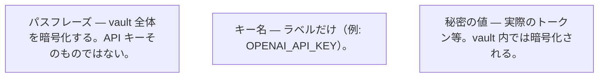
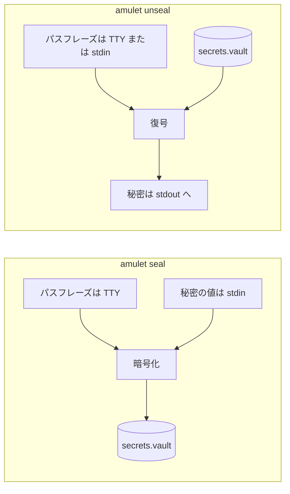

# Amulet — ハードウェア紐付きゼロトレース秘密情報管理ツール

## 概要

Amulet は、秘密情報（APIキー、トークン、パスワード等）を **特定の物理マシン** に暗号化バインドする CLI ツールです。

- 秘密は `.env` には書かず、**暗号化した vault ファイル**に入れます。
- 秘密の**値**を、コマンドの引数や「いつも使う環境変数」に載せません（必要なら**パイプ**で渡します）。
- 復号に失敗したときは**理由を表示せず**、失敗として終了します（仕様です）。
- コーディング支援AIやほかのツールに、うっかり秘密が渡りにくい形を目指しています。

**上で出てくる語の早見:** **argv** = コマンド名のあとに書く引数（秘密はここに載せません）。**stdin** = パイプなどでコマンドへ渡す入力（`seal` が読む秘密はここから）。**終了コード 1** = ざっくり「失敗」。復号に失敗したとき Amulet は**わざと**詳しいエラーを出しません。

**ターミナル入門（標準入出力・パイプ・リダイレクト・PowerShell / bash / cmd）:** [標準入力と標準出力](docs/getting-started-ja.md#標準入力と標準出力stdin--stdout--stderr) · [リダイレクトと Windows のシェル](docs/getting-started-ja.md#パイプの先-リダイレクトと-windows-のシェル)。

---

## 責務と限界

Amulet が想定しているのは **健全な開発者マシン**での、**不注意による事故**（`.env` の誤コミット、ワークスペースを読むツールへの露出、`argv` への秘密の載せ間違いなど）の削減です。チーム向けの秘密基盤（Infisical、クラウド KMS 等）の**代替**ではありません。

**脅威モデル:** **OS 全体が既に侵害されている**、**ターミナルや stdin をマルウェアが握っている**ような状況では、ソフトウェアだけでは防ぎきれません（Amulet の責務外です）。

**平文の一括エクスポートは意図的に無い:** すべてのエントリを一度に平文ファイルへ書き出すコマンドは**用意していません**（誤用・漏洩のリスクが大きいため）。バックアップや復旧は [移行・複数端末・障害時の注意](#移行複数端末障害時の注意) を参照してください。**ciphertext の vault をコピーする**、**Portable で別マシンでも復号できるようにする**、**パスワードマネージャに退避して新マシンで re-seal** など、ドキュメントの手順でカバーします。

---

## 初めて使う方へ

**一言でいうと:** API キーなどの秘密を、暗号化された **vault ファイル**（例: `secrets.vault`）の中に保存します。**パスフレーズ**はあなたが決め、vault を保護します。**キー名**を付けて **seal**（書き込み）し、**unseal**（読み出し）で取り出します。**Locked Mode**（デフォルト）では、**seal したのと同じマシン**でないと復号できません。

| 用語 | 意味 |
|------|------|
| **vault** | ディスク上の暗号化ファイル（`*.vault`）。平文の秘密は含みません。git にコミットしても問題ない設計です。 |
| **キー名** | vault 内でのエントリのラベル（例: `OPENAI_API_KEY`）。**秘密の値そのものではありません。** |
| **パスフレーズ** | seal 時にあなたが入力するパスワード。unseal やアプリからの利用でも **同じもの**が必要です。**紛失すると ciphertext だけからは秘密を復元できません。** |
| **seal / unseal** | **seal** = 秘密を vault に書き込む。**unseal** = 取り出す（stdout に出す、または Node のヘルパー経由）。 |
| **stdout** | ターミナルに普通に表示されるコマンドの出力。`unseal` は復号した秘密をここに出します。 |

**図**（GitHub 上で自動レンダリングされます）:

*混同しやすいものの整理:*



*典型的な CLI で、入力がどこから来てどこへ行くか:*



**読み方のおすすめ:** [ターミナルなどの入門](docs/getting-started-ja.md)（任意）→ [インストール](#インストール) → [クイックスタート](#クイックスタートバイブコーディングai-開発向け) → 複数マシンなら [動作モード](#動作モード) → 細かいオプションは [CLI 使い方](#cli-使い方)。

---

## なぜ Amulet か

Infisical・HashiCorp Vault・AWS Secrets Manager などの既存ツールはチーム共有・監査ログ・細かいアクセス制御に優れていますが、サーバーのセットアップと運用コストが伴います。

Amulet はその逆を狙っています。

| | 既存の秘密管理プラットフォーム | Amulet |
|---|---|---|
| セットアップ | サーバー・クラウド契約が必要 | バイナリ1本 |
| チーム共有 | ✅ 得意 | ❌ 設計外（1台向け） |
| ネットワーク依存 | あり | なし（完全ローカル） |
| ハードウェアバインド | なし | ✅ Locked Mode |
| AI エージェント対策 | 間接的 | 構造的に設計 |

**Amulet が向いている場面**
- 個人開発・フリーランス・一人チーム
- サーバーを立てずにローカルで完結させたい
- AI エージェントやバイブコーディングで秘密が漏れるのを構造的に防ぎたい
- 軽量なツールをすぐ使い始めたい

**Amulet が向いていない場面**
- チームで秘密を共有・ローテーションしたい → Infisical・Vault 等を検討
- CI・コンテナ環境が主体 → クラウドの Secrets Manager との併用を推奨

---

## インストール

> **前提:** ターミナルでコマンドを実行し、ファイルのパスを扱えること。**初めての方**は先に [ターミナル・PATH・環境変数（入門）](docs/getting-started-ja.md) を読んでも大丈夫です。

[GitHub Releases](https://github.com/Tuki-Sana/amulet/releases) から最新バイナリをダウンロードしてください：

| OS | ファイル |
|---|---|
| Linux (x86_64) | `amulet-linux-x86_64` |
| macOS (Apple Silicon) | `amulet-macos-aarch64` |
| macOS (Intel) | `amulet-macos-x86_64` |
| Windows (x86_64) | `amulet-windows-x86_64.exe` |

**Linux / macOS:** 上の表から **自分が落としたファイル名**に置き換えてください（Apple Silicon と Intel で名前が違います）。

```sh
chmod +x ./amulet-macos-aarch64
sudo mv ./amulet-macos-aarch64 /usr/local/bin/amulet
```

`sudo` が使えない場合は、すでに `PATH` の通っているディレクトリに置くか、そのディレクトリを `PATH` に追加してください。

**Windows:** `chmod` は不要です。`amulet.exe` にリネームし、すでに `PATH` の通っているフォルダへ置くか、環境変数の画面でそのフォルダを `PATH` に追加してください。例: ダウンロードフォルダで PowerShell を開き、`bin` を作ってから `Move-Item .\amulet-windows-x86_64.exe "$env:USERPROFILE\bin\amulet.exe"` のように移動します（`bin` は事前に作成）。

---

## クイックスタート（バイブコーディング・AI 開発向け）

> AI ツール（Cursor・Claude Code 等）を使って開発する場合、AI が `.env` パターンを提案することがあります。このプロジェクトでは代わりに Amulet を使います。Amulet は秘密情報を漏洩しやすい経路から遠ざけますが、チャットへの貼り付けや AI の古い提案は別の問題です — 運用習慣も合わせて意識してください。

手順で迷ったら先に [初めて使う方へ](#初めて使う方へ) を読んでください。

**1. vault を初期化する**

```sh
amulet init --file secrets.vault
```

**空の** vault ファイルだけが作られます。この時点ではパスフレーズは聞かれません。

**2. シークレットを登録する（`.env` への書き込みの代わりに）**

- `seal` を実行すると、ターミナルで **パスフレーズの入力**を求められます（表示はマスクされます）。これは **API キーではなく**、vault 全体を守るためのパスワードです。あとで unseal する・下の `withSecret` を使うときも **同じパスフレーズ**が必要です。
- `sk-xxxxxxxx` は**例示**です。実際の API キーやトークンに**置き換えて**ください。
- **秘密の値**は **stdin** から読みます（ここでは `echo -n …` がパイプで流しています）。**コマンドライン引数（argv）には載りません。**
- `OPENAI_API_KEY` は vault 内の**キー名**（エントリの識別子）です。キー名は vault フォーマット上プレーンテキストで保持されますが、**値だけ**が暗号化されます。

```sh
echo -n "sk-xxxxxxxx" | amulet seal OPENAI_API_KEY --file secrets.vault
```

> **シェル履歴:** `echo '秘密'` の形で打つと、シェル履歴に残ることがあります。一度きりの登録ならよくあるトレードオフです。自動化では CI のシークレット注入など、stdin を安全に供給する方法を推奨します。

**3. プロジェクトで秘密を読み出す**

スタックに合わせて選んでください。**パスフレーズ**は `seal` のときと同じものです（ローカルでは `VAULT_PASSPHRASE` で渡すことが多いです。実値はコミットせず、チャットにも貼らないでください）。

**A — シェルだけ（Node.js 不要）**

- 対話で試す: `amulet unseal --tty OPENAI_API_KEY --file secrets.vault`（秘密は stdout に出ます）。詳しくは [秘密情報の読み出し（unseal）](#秘密情報の読み出しunseal)。
- スクリプト向け（パスフレーズは変数から。stdin の1行目がパスフレーズです）:

```sh
SECRET=$(printf '%s\n' "$VAULT_PASSPHRASE" | amulet unseal OPENAI_API_KEY --file secrets.vault) || exit 1
# 同じシェル内で "$SECRET" を使う — メモリ上に残る点に注意。`export` するかは用途次第
```

**B — Python（標準ライブラリのみ）**

`subprocess` で `amulet` を起動します。パスフレーズは **stdin の1行目**として渡します（CLI の仕様と同じ）。API キー文字列は環境変数に載せず、**vault のパスフレーズだけ** `VAULT_PASSPHRASE` から渡す形が無難です。

```python
import os
import subprocess

def unseal(key: str, vault: str = "secrets.vault") -> str:
    passphrase = os.environ["VAULT_PASSPHRASE"] + "\n"
    completed = subprocess.run(
        ["amulet", "unseal", key, "--file", vault],
        input=passphrase,
        text=True,
        capture_output=True,
        check=True,
    )
    return completed.stdout

# api_key = unseal("OPENAI_API_KEY")
```

`amulet` が `PATH` で見つかるようにするか、上のリストの先頭をバイナリのフルパスに変えてください。

**C — Node.js / TypeScript**

`withSecret` はこのリポジトリの `wrappers/node/amulet.ts` にあります。プロジェクトにコピーするか、レイアウトに合わせて import パスを変えてください。内部で `amulet` CLI を起動します。

**`VAULT_PASSPHRASE` の設定例（実値はコミットせず、チャットにも貼らないでください）:**

- **今開いているターミナルだけ:**  
  - macOS / Linux: `export VAULT_PASSPHRASE='あなたのパスフレーズ'`  
  - PowerShell: `$env:VAULT_PASSPHRASE = 'あなたのパスフレーズ'`
- **Cursor / VS Code の統合ターミナル:** `settings.json` の `terminal.integrated.env.osx` / `linux` / `windows` で、新しいターミナルに変数を渡せます（エディタのドキュメント参照）。git に乗らない**マシン固有**や**ワークスペース限定**の設定を推奨します。

`await` は `withSecret` が終わるまで待ちます。`(secret) => { ... }` の関数の中だけで秘密の `Buffer` を使い、終了後は Amulet がメモリをゼロ埋めします。利用はコールバック内に留めてください。

```typescript
import { withSecret } from './wrappers/node/amulet';

// seal 時と同じパスフレーズ。ローカルでは VAULT_PASSPHRASE などで渡すことが多い（値はコミットしない）。
const passphraseBuf = Buffer.from(process.env.VAULT_PASSPHRASE!, 'utf8');

await withSecret('OPENAI_API_KEY', 'secrets.vault', passphraseBuf, async (secret) => {
  await callOpenAI(secret);
});
```

通常、**API キーそのもの**を `process.env` に置かないでください（vault にだけ置きます）。

パスフレーズの受け取り方や `binaryPath` などは [CLI 使い方 → Node.js / TypeScript からの利用](#nodejs--typescript-からの利用) を参照してください。

**4. 必要なキー名だけ記録する（`.env.example` の代わりに）**

```
# 必要なシークレット（値は vault に保存）
OPENAI_API_KEY
DATABASE_PASSWORD
```

**5. `secrets.vault` は git にコミットして OK。`.env` は作らない。**

### 何も表示されず終了コード 1 で unseal が終わるとき

多くの場合 **復号に失敗した**状態です。Amulet は**理由を表示しません**（仕様です）。次を順に確認してください。

1. **パスフレーズ** — `seal` のときと同じか。パイプで渡すときは [秘密情報の読み出し（unseal）](#秘密情報の読み出しunseal) と同様に、改行の付け方を含めて正しいか。
2. **vault のパス** — `--file` が正しい `*.vault` を指し、ファイルが存在するか。
3. **キー名** — `amulet seal …` と同じ綴りか（大文字・小文字も含めて一致）。
4. **Locked モード** — **このマシン**で seal した vault か。別 PC へコピーしただけでは Portable でない限り失敗します。
5. **終了コード** — 失敗直後に `echo $?`（Unix）または `echo $LASTEXITCODE`（PowerShell）で `1` か確認。

---

## 動作モード

### Locked Mode（デフォルト）

vault を作成したマシン以外では復号できない。

```
KDF 入力 = Argon2id(passphrase ‖ 0x00 ‖ machine_id, salt)
```

- Linux: `/etc/machine-id`（fallback: `/var/lib/dbus/machine-id`）
- macOS: `IOPlatformUUID`（`ioreg` 経由）
- Windows: `HKLM\SOFTWARE\Microsoft\Cryptography\MachineGuid`（`reg query` 経由）

### Portable Mode（`--portable` 付きで seal した場合）

machine_id を KDF に混ぜない。別マシンへの移行や検証用途向け。

```
KDF 入力 = Argon2id(passphrase, salt)
```

- vault ヘッダの `flags` bit 0 が 1 にセットされる
- `unseal` 時はヘッダを自動読み取りモード判定（ユーザーが `--portable` を指定する必要なし）
- セキュリティが低下するため、seal 時に警告メッセージを stderr に出力する

---

## Vault ファイルフォーマット（バイナリ）

```
[1 byte]  version  = 0x01
[1 byte]  flags    (bit 0 = portable mode)
[16 byte] Argon2id salt  （CSPRNG ランダム、seal ごとに生成）
[12 byte] ChaCha20-Poly1305 nonce （CSPRNG ランダム、seal ごとに生成）
[4 byte]  ciphertext 長（big-endian u32）
[N byte]  ciphertext + 16 byte Poly1305 認証タグ
```

---

## 暗号仕様

| 項目 | 仕様 |
|------|------|
| KDF | Argon2id（m=64MiB, t=3, p=1） |
| 暗号化 | ChaCha20-Poly1305 |
| 鍵長 | 256 bit（32 byte） |
| ソルト | 16 byte CSPRNG（vault ヘッダに保存） |
| Nonce | 12 byte CSPRNG（vault ヘッダに保存、再利用なし） |
| AAD | version バイト（フォーマット変更検知用） |

---

## CLI 使い方

### 初期化

```sh
amulet init --file secrets.vault
```

空の vault ファイルを作成する。

### 秘密情報の書き込み（seal）

```sh
# Locked Mode（デフォルト）: パスフレーズを /dev/tty でプロンプト入力、秘密情報は stdin から
echo -n "sk-xxxxxxxx" | amulet seal OPENAI_API_KEY --file secrets.vault

# Portable Mode: --portable フラグを追加（警告が stderr に出力される）
echo -n "sk-xxxxxxxx" | amulet seal --portable OPENAI_API_KEY --file secrets.vault
```

> `seal` はパスフレーズを `/dev/tty` から読み取ります（エコーオフ）。秘密情報は stdin のみ。

### 秘密情報の読み出し（unseal）

stdin の第1行をパスフレーズとして読み取ります。vault ヘッダから Locked / Portable モードを自動判定します。

**対話入力**（ターミナルで直接使う場合）

```sh
# --tty: /dev/tty からエコーオフでパスフレーズを入力（seal と同じ動作）
amulet unseal --tty OPENAI_API_KEY --file secrets.vault

# --tty なし: stdin 第1行をそのまま読む（プロンプト・エコーオフなし）
amulet unseal OPENAI_API_KEY --file secrets.vault
```

> `--tty` なしでターミナルから入力すると、パスフレーズが画面にエコーされます。手元で使う場合は `--tty` を推奨します。

**パイプ入力**（スクリプトや CI で使う場合）

```sh
# パスフレーズをパイプで渡す
printf "mypassphrase\n" | amulet unseal OPENAI_API_KEY --file secrets.vault

# シェル変数に代入
SECRET=$(printf "mypassphrase\n" | amulet unseal OPENAI_API_KEY --file secrets.vault)
```

> CI では `printf` の代わりに CI プラットフォームのシークレット注入（GitHub Actions secrets 等）を使用してください。ターミナルで手動 `export` するとシェル履歴に残るため避けること。

**スクリプトでの終了コード確認**

```sh
if ! printf "mypassphrase\n" | amulet unseal OPENAI_API_KEY --file secrets.vault > /dev/null; then
  echo "unseal failed" >&2
  exit 1
fi
```

- 成功時: 秘密情報を stdout に出力（末尾改行なし）
- 失敗時: 何も出力せず終了コード 1 で終了（診断メッセージなし）

> **トラブルシュート:** 無言で失敗するときは [クイックスタート → 何も表示されず終了コード 1](#何も表示されず終了コード-1-で-unseal-が終わるとき) を参照。

### Node.js / TypeScript からの利用

```typescript
import { withSecret } from './wrappers/node/amulet';

// パスフレーズの受け取り方は「漏れやすい経路を避ける」が基本方針。
// CI/CD のシークレット注入（GitHub Actions secrets 等）は許容範囲内。
// ターミナルでの手動 export や .env への平文書き込みは、シェル履歴・AI ツールの文脈に残るため避けること。
const passphraseBuf = Buffer.from(process.env.VAULT_PASSPHRASE!, 'utf8');

await withSecret('OPENAI_API_KEY', 'secrets.vault', passphraseBuf, async (secret) => {
  // secret は Buffer 型。このコールバック内でのみ有効。
  // 文字列にキャストしない。
  await callExternalApi(secret);
});
// コールバック完了後、secret Buffer は自動的にゼロ埋めされる。
// コールバックが例外をスローした場合もゼロ埋めは保証される。
```

> `withSecret` の `binaryPath` オプションで `amulet` バイナリのパスを指定できます（デフォルトは PATH 検索）。

---

## ファイル命名規則

| ファイル | 命名例 | 説明 |
|----------|--------|------|
| vault（暗号化済みバイナリ） | `secrets.vault`, `prod.vault` | `*.vault` 拡張子推奨。git 管理可。 |
| 一時 .env（開発用ブリッジ） | `.env.tmp`, `.secrets.env` | 必ず `.gitignore` に追加。平文がディスクに出ることを意識すること。 |

`*.vault` ファイルは暗号化済みバイナリなので git にコミットして問題ありません。  
平文 `.env` を生成する場合は開発用ブリッジと位置づけ、`trap` による削除と `.gitignore` 登録を徹底してください。

---

## Docker Compose / Podman Compose との連携

vault を Compose ベースのワークフローに統合するには、**一時ファイル経由**が最も安定した方法です。

```sh
TMP_ENV=$(mktemp)
chmod 0600 "$TMP_ENV"
trap "rm -f '$TMP_ENV'" EXIT

printf "mypassphrase\n" | amulet unseal OPENAI_API_KEY --file secrets.vault > "$TMP_ENV"

docker compose --env-file "$TMP_ENV" up
# Podman の場合: podman compose --env-file "$TMP_ENV" up
```

> **注意:** 一時ファイルはディスクに短時間平文が出ます。「開発用ブリッジ」と位置づけ、`trap` による削除を必ず設定してください。本番環境では CI のシークレット注入（GitHub Actions secrets 等）を使用してください。

プロセス置換（`<(amulet unseal …)`）も機能しますが、bash 依存で Compose の実行環境によって挙動が変わるため、上記の一時ファイル方式を推奨します（上級者向け）。

---

## 環境別運用ガイド：Locked vs Portable

Locked Mode では、vault は別マシンに持ち出せても**別マシンでは復号できません**（ciphertext のコピー自体は可能）。デフォルトはローカル／単一ホスト向けの設計で、CI やコンテナでは Portable や他ツールとの組み合わせが基本です。

| 環境 | 推奨モード | 理由 |
|------|-----------|------|
| 本番の固定サーバ | **Locked** | machine_id が安定している。vault をコピーされても別マシンでは復号不可 |
| 開発者の個人PC | **Locked**（各自） | 各開発者が自分のマシンで seal する |
| CI（GitHub Actions 等） | **Portable** | ランナーが毎回変わり machine_id が安定しない |
| コンテナ / Kubernetes | **Portable** | Pod の machine_id が安定しないことが多い |
| 移行・検証用途 | **Portable** | 別マシンでの復号が意図的に必要な場合 |

> **OS 再インストール・ハードウェア交換時の注意:** machine_id が変わると Locked vault は復号不能になります（Linux: OS 再インストール、macOS: マザーボード交換）。runbook に復旧手順を記載してください。

**チームでの運用パターン**

シンプルで拡張しやすい基本方針：

- 本番ホスト: サーバ上で seal・unseal（Locked）
- CI・ステージング: CI プラットフォームのシークレット注入か、強いパスフレーズを使った Portable vault
- Locked vault はマシン間で共有しない — 各環境が自前で seal する

---

## 移行・複数端末・障害時の注意

### vault ファイルのバックアップと「復号できるバックアップ」は別物

Locked vault のファイルをコピーしてもバックアップにはなりません。別マシンでは machine_id が異なるため復号できないからです。

| バックアップの種類 | 内容 | Locked での復旧 |
|------------------|------|----------------|
| vault ファイルのコピー | 暗号化済みバイナリ | ❌ 別マシンでは復号不可 |
| 旧マシンで unseal した平文 | 秘密情報の生データ | ✅ 新マシンで re-seal できる |
| Portable vault のコピー | パスフレーズさえあれば復号可 | ✅ どのマシンでも復号可 |

### 計画的なマシン移行

旧マシンが生きている間に次の手順を踏んでください：

```sh
# 旧マシンで unseal して平文を取り出す
printf "mypassphrase\n" | amulet unseal SECRET_KEY --file secrets.vault

# 新マシンで re-seal（Locked なら新マシンの machine_id にバインドされる）
echo -n "<取り出した値>" | amulet seal SECRET_KEY --file secrets.vault
```

### 突然の故障

旧マシンが起動しなくなった場合、Locked vault は**復号できません**。事前の対策が必要です：

- 秘密情報を別の安全な場所（パスワードマネージャー等）にも保管しておく
- または Portable vault を別途作成してオフラインバックアップとして保管する

### 複数端末での開発

同じ Locked vault を複数端末で共有することはできません。以下のいずれかを選んでください：

- **端末ごとに別 vault** — 各端末で seal する（Locked のまま、端末ごとに独立）
- **Portable vault を共有** — パスフレーズを安全に共有し、全端末で同じ vault を使う
- **開発だけ Portable、本番は Locked** — 環境で使い分ける

---

## セキュリティ設計原則

| 原則 | 内容 |
|------|------|
| No .env Policy | ディスクへの平文書き込みは開発用途でも一切実装しない |
| Silent Failure | 復号失敗時は詳細エラーなし、終了コード 1 のみ |
| No Leakage | ログ・エラーに秘密情報・machine_id・鍵断片を含まない |
| Immediate Erasure | `std.crypto.utils.secureZero` で使用直後にメモリ抹消 |
| Stdin Only | 秘密情報は argv・環境変数経由で受け取らない |

---

## ビルド・テスト

```sh
# ビルド（ReleaseSafe 推奨）
zig build -Doptimize=ReleaseSafe

# machine-ID 取得の動作確認
zig build probe

# 全ユニットテスト
zig build test
```

**対応 OS:** Linux（systemd ホスト）、macOS、Windows

---

## プロジェクト構成

```
amulet/
├── src/
│   ├── probe_id.zig   # OS別 machine-ID 取得
│   ├── crypto.zig     # Argon2id + ChaCha20-Poly1305 暗号コア
│   ├── main.zig       # CLI (seal / unseal / init)
│   └── schema.zig     # comptime キー名バリデーション
├── wrappers/
│   └── node/
│       └── amulet.ts  # Node.js/TypeScript ラッパー
├── PLAN.md
├── CHECKLIST.md
└── README_JA.md
```
