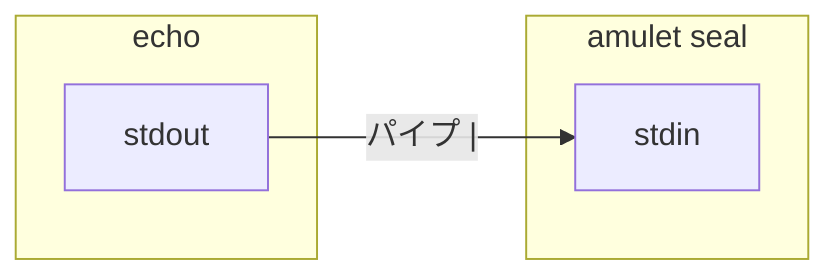

# はじめに: ターミナル・PATH・環境変数

**コマンドラインにあまり慣れていない方向け**の短いイントロです。Amulet は **CLI（ターミナルで動かす）ツール**なので、このページで最低限の用語をそろえてから [README 本編](../README_JA.md) に進むと読みやすくなります。**標準入力・標準出力**でつまずく場合は、先に [標準入力と標準出力](#標準入力と標準出力stdin--stdout--stderr) を読んでください（Amulet の説明と直結します）。**`>` / `<` や Windows のシェル**で迷う場合は [パイプの先: リダイレクトと Windows のシェル](#パイプの先-リダイレクトと-windows-のシェル) を参照してください。

---

## ターミナルとは

**ターミナル**（コンソール）は、文字で **コマンドを打って** コンピュータに処理をさせ、結果を文字で受け取る窓です。macOS なら **ターミナル.app** や **Cursor / VS Code 内蔵のターミナル**、Windows なら **PowerShell** や **Windows Terminal** などを使います。

通常は **プロンプト**（行末が `$` や `>` など）が表示され、そこにコマンドを入力して Enter を押します。

---

## ファイル・フォルダ・パス

コマンドはある **カレントディレクトリ**（今いるフォルダ）を基準に動きます。パスには次のような種類があります。

- **絶対パス:** ディスクの先頭からの道のり（例: `/usr/local/bin/amulet`、Windows では `C:\Users\あなた\bin\amulet.exe`）。
- **相対パス:** 今いる場所からの道のり（例: `./secrets.vault` は「今のフォルダにある `secrets.vault`」）。

README では `amulet` を **PATH が通ったフォルダ**に置くと、どこからでも `amulet` と打てる、と説明します（次の節）。

---

## PATH とは

**PATH** は **環境変数**の一つで、「コマンド名だけ打ったときに、どのフォルダの中をプログラムを探しに行くか」の一覧です。`amulet` が PATH 上のフォルダに入っていれば、次のように打てます。

```sh
amulet --help
```

`command not found` と出るときは、バイナリが PATH に含まれる場所にないか、**フルパス**（例: ダウンロードフォルダの `./amulet-macos-aarch64`）で実行する必要があります。

Windows も同様で、`PATH` に入っているフォルダに `amulet.exe` を置くと `amulet` と打てます。

---

## 環境変数とは

**環境変数**は、名前付きの値で、シェルから起動するプログラムに渡されます（エディタの統合ターミナルでも、設定すれば同様です）。

- **そのターミナルの間だけ:** 閉じるまで有効。
  - macOS / Linux: `export MY_VAR=value`
  - PowerShell: `$env:MY_VAR = "value"`
- Amulet のドキュメントでは、**vault のパスフレーズ**を渡す名前として `VAULT_PASSPHRASE` を例にすることがあります。**実値は git にコミットしないでください。**

プログラム側では `process.env.VAULT_PASSPHRASE` などで読みます。`.env` ファイルとは別の話ですが、名前と値の取り扱いは同様に注意してください。

---

## 標準入力と標準出力（stdin / stdout / stderr）

ターミナルで動くプログラムは、ざっくり **3本の流れ（ストリーム）** を持っていると考えると分かりやすいです。

| 流れ | 略名 | 役割のイメージ |
|------|------|----------------|
| **標準入力** | **stdin** | プログラムが**読み込む**文字（キーボード、ファイル、**別コマンドからパイプ**など）。 |
| **標準出力** | **stdout** | **普通の成功時の出力**（画面に表示したり、次のコマンドに渡したりする）。 |
| **標準エラー出力** | **stderr** | **エラーや警告**用。stdout と分かれているので、データ用のパイプに混ざりにくいです。 |

標準では、stdin はキーボード、stdout と stderr は**同じターミナル画面**に表示されます。見た目は一緒ですが、プログラム内部では **stdout と stderr は別**です。Amulet の `seal` が Portable モードで **WARNING** を出すときは stderr に出ることがあります（秘密の値そのものとは別の流れです）。

### パイプは「左の stdout → 右の stdin」

**パイプ**（`|`）は、**左側のコマンドの標準出力**を、**右側のコマンドの標準入力**につなぐ記号です。



README にもある例:

```sh
echo -n "secret-value" | amulet seal OPENAI_API_KEY --file secrets.vault
```

- `echo` が出した文字列が **`echo` の stdout** に出る（多くのシェルでは `-n` で末尾改行なし）。
- パイプがそれを **`amulet seal` の stdin** に流す。
- 秘密の値は **`seal` のあとに引数として書かない**のがこのツールの設計です。

### パスフレーズと「秘密の値」（Amulet）

`amulet seal` では、**API キーなどの秘密の値**は **stdin** から読みます（上のようにパイプで渡すのが典型）。一方、**vault を暗号化するパスフレーズ**は別経路（ターミナル上の非表示入力など）で読みます。README の手順どおりにすればよいですが、「パイプで流しているのはどちらか」を混同しないと読みやすくなります。

`amulet unseal` では、復号に成功すると**秘密の平文**が **stdout** に出ます（末尾改行なし）。シェルでは `$( ... )` で取ったり、別プログラムにパイプしたりします。

### Amulet の README とどう関係するか

Amulet は **秘密をコマンドライン引数や通常の環境変数に載せない**設計です。Unix 系では **stdin / stdout でデータを渡す**のが普通なので、その前提が分かると [CLI 使い方](../README_JA.md#cli-使い方) が読みやすくなります。

---

## パイプの先: リダイレクトと Windows のシェル

**パイプ**（`|`）はコマンドとコマンドをつなぎます。**リダイレクト**は、ストリームを**ファイル**に向けたり、ファイルから読み込んだりします（パイプとは別の仕組みです）。また **シェル**（bash・PowerShell・コマンドプロンプト）によって書き方が違います。README の `sh` に近い例は、多くが **Unix 系シェル**想定です。

### リダイレクト（`>` と `<`）

| 書き方（Unix 系や Windows でもよく使う形） | 意味 |
|------------------------------------------|------|
| `command > file` | **stdout** を `file` に書く。**新規作成または上書き**（元の内容は消える）。 |
| `command >> file` | stdout を `file` の**末尾に追加**。 |
| `command < file` | **stdin** をキーボードではなく `file` から読む。 |

`>` は**うっかり既存ファイルを潰す**ことがあるので注意してください。秘密を一時ファイルに出す場合は、**短命のファイル**にして後から消す、という README の Compose 例の考え方と同じです。

**stderr** だけ別ファイルに送るなどは、シェルごとに書き方が違います（bash では `2>` など）。必要になったらそのシェルのドキュメントを当ててください。

### bash / zsh（macOS・Linux）と Windows の Git Bash

README の例と相性がよいです。`export`、`chmod`、`echo -n`、`|`、`$(...)`、`printf '...\n'` など。パスは `/` が中心です。

### PowerShell（Windows でこのリポジトリの手順に追いやすいことが多い）

- セッション中の変数: `$env:変数名 = "値"`。
- パイプ `|` はありますが、**`echo` は Unix の `echo` ではありません**（`Write-Output` の別名）。bash の `echo -n …` をそのまま真似すると挙動が違うことがあります。`amulet` に stdin で渡すときは、[CLI 使い方](../README_JA.md#秘密情報の読み出しunseal) の `printf` 例に合わせるか、**Git Bash** で同じコマンドを打つ方が安全なことが多いです。
- パスは `\` と `/` の両方が使えることが多いです。

### コマンドプロンプト（`cmd.exe`）

- そのウィンドウの間だけ: `set 変数名=値`、参照は `%変数名%`。
- bash の **`export` に相当するものはありません**（動きも Unix と違います）。
- 単純な `>` / `<` のリダイレクトはありますが、**パイプや `echo` の癖**で、Unix の一行をそのままコピペしづらいことがあります。
- README の多段の例を追うなら、**PowerShell** か **Git Bash** の方が楽になることが多いです。

### 実務的なすすめ

Windows では **Windows Terminal + PowerShell**、または **Git for Windows の Git Bash** が、README の例との相性がよいことが多いです。**cmd だけ**でも `PATH` を通して `amulet.exe` を直接叩く分には問題ありませんが、ドキュメントのシェル例をそのまま使うには、上記のどちらかに寄せると詰まりにくいです。

---

## Python の `subprocess`（最低限）

[README のクイックスタート](../README_JA.md#クイックスタートバイブコーディングai-開発向け) では、`subprocess.run` で `amulet unseal` を起動する例を載せています。これは「シェルでパイプするときと同じように、パスフレーズを標準入力で渡す」ためのものです。

`subprocess` 全体を覚える必要はなく、**パスやキー名を自分の環境に合わせる**用途でコピーして構いません。Python を使わない場合は、同じセクションの **シェルだけ** の手順で十分です。

---

## 次のステップ

[README_JA.md](../README_JA.md) に戻り、[インストール](../README_JA.md#インストール) → [クイックスタート](../README_JA.md#クイックスタートバイブコーディングai-開発向け) の順で進めてください。
