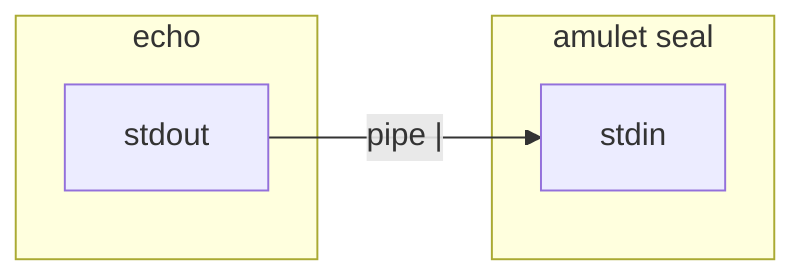

# Getting Started: Terminal, PATH, and Environment Variables

This page is for people who are **new to the command line**. Amulet is a CLI tool, so you run it in a **terminal**. You do not need deep expertise — enough to follow the [main README](../README.md) is fine. If **stdin / stdout** confuse you, read [Standard input and output](#standard-input-and-output-stdin-stdout-stderr) first — Amulet relies on them. If **`>` / `<` or Windows shells** confuse you, see [Beyond pipes: redirection and Windows shells](#beyond-pipes-redirection-and-windows-shells).

---

## What is a terminal?

A **terminal** (or “console”) is a text window where you type **commands** and the computer runs programs and prints results. On macOS you might use **Terminal.app** or the terminal built into **Cursor / VS Code**. On Windows, **PowerShell** or **Windows Terminal** play the same role.

You usually see a **prompt** (a line ending in `$` or `>`), then you type a command and press Enter.

---

## Files, folders, and paths

Commands run in a **current directory** (folder). Paths can be:

- **Absolute:** from the root of the disk, e.g. `/usr/local/bin/amulet` (Unix) or `C:\Users\you\bin\amulet.exe` (Windows).
- **Relative:** from where you are now, e.g. `./secrets.vault` means “`secrets.vault` in this folder”.

The README sometimes says to put the `amulet` binary in a directory that is on your **PATH** (see below) so you can type `amulet` from anywhere.

---

## What is PATH?

**PATH** is an **environment variable** that lists folders where the shell looks for programs. If `amulet` is in one of those folders, you can run:

```sh
amulet --help
```

If the shell says `command not found`, either the binary is not in a PATH folder, or you need to use a **full path** to the file (e.g. `./amulet-macos-aarch64` from the download folder).

On Windows, the same idea applies: directories in PATH are searched for `amulet.exe`.

---

## Environment variables

An **environment variable** is a named value available to programs started from your shell (or from your editor’s integrated terminal, if configured).

- **Session only:** set in the terminal; lasts until you close that terminal.
  - macOS / Linux: `export MY_VAR=value`
  - PowerShell: `$env:MY_VAR = "value"`
- **For Amulet’s docs**, `VAULT_PASSPHRASE` is often used as the **name** for “the passphrase string,” never committed to git.

Programs **read** these variables (e.g. `process.env.VAULT_PASSPHRASE` in Node). They are not the same as putting API keys in `.env` files — still treat names and values carefully and avoid pasting secrets into chat.

---

## Standard input and output (stdin, stdout, stderr)

When a program runs in a terminal, it is usually connected to three **streams** (think of them as three channels):

| Stream | Short name | Typical role |
|--------|------------|----------------|
| **Standard input** | **stdin** | Text the program **reads** (from the keyboard, a file, or another program). |
| **Standard output** | **stdout** | Normal **success** output the program **writes** (what you usually want to capture or pass on). |
| **Standard error** | **stderr** | **Errors and warnings**, separate from stdout so they do not get mixed into data pipes. |

By default, stdin is your keyboard and stdout/stderr both print to the **same terminal window** — so they *look* merged, but the program treats them separately. Amulet’s `seal` may print a **WARNING** to stderr in portable mode while still reading the secret from stdin; that is why stderr exists.

### Pipes connect stdout to stdin

The **pipe** character `|` means: take the **stdout** of the command on the **left**, and feed it as **stdin** to the command on the **right**.



Example from the README:

```sh
echo -n "secret-value" | amulet seal OPENAI_API_KEY --file secrets.vault
```

- `echo` writes `secret-value` to **its** stdout (no newline because of `-n` on many shells).
- The pipe sends that bytes into **`amulet seal`’s stdin**.
- The secret is **not** passed as a command-line argument after `seal` — that is intentional.

### Passphrase vs secret (Amulet)

For `amulet seal`, the **secret value** comes from **stdin** (often via a pipe, as above). The **passphrase** that encrypts the vault is read separately (from the terminal with echo off, or from a script’s stdin line — see the [README](../README.md)). So “what you pipe in” is not the same as “the vault password.”

For `amulet unseal`, the **decrypted secret** is written to **stdout** (no trailing newline). Scripts often capture that with `$(...)` or pass it to another program.

### Why this matters for Amulet

Amulet is designed so **secret values are not placed in argv or normal env vars**; stdin/stdout are the normal Unix way to move data between programs without putting it in the argument list. Understanding stdin/stdout makes the [CLI Usage](../README.md#cli-usage) section much easier to read.

---

## Beyond pipes: redirection and Windows shells

A **pipe** (`|`) connects one program’s output to another program’s input. **Redirection** sends a stream **to or from a file** (or another file descriptor). **Shells** (bash, PowerShell, Command Prompt) differ in syntax — the README’s `sh`-style snippets are mostly written for **Unix-style** shells.

### Redirection (`>` and `<`)

| Syntax (common on Unix shells and many Windows setups) | Meaning |
|------------------------------------------------------------|---------|
| `command > file` | Send **stdout** to `file`. Creates the file or **overwrites** what was there. |
| `command >> file` | Append stdout to `file`. |
| `command < file` | Read **stdin** from `file` instead of the keyboard. |

`>` is easy to misuse: you can destroy a file accidentally. For secrets, prefer **short-lived temp files** and delete them afterward (similar idea to the README’s Compose examples).

Redirecting **stderr** uses extra syntax (e.g. `2>` in bash) and varies by shell — check your shell’s documentation if you need to separate errors from data.

### Bash / zsh (macOS, Linux) and Git Bash on Windows

These match most **POSIX-style** examples in the README: `export VAR=value`, `chmod`, `echo -n`, `|`, `$(...)`, `printf '...\n'`. Paths use `/`.

### PowerShell (recommended on Windows for following this repo)

- Set a variable for the current session: `$env:VAR = "value"`.
- Pipelines use `|`, but **`echo` is not Unix `echo`** — it is an alias for `Write-Output`. Copying `echo -n …` from bash tutorials may not behave the same. For feeding stdin to `amulet`, prefer patterns that match the [CLI Usage](../README.md#read-a-secret-unseal) section (e.g. `printf` via **Git Bash**, or a here-string / explicit bytes if you know PowerShell well).
- Paths accept `\` or `/` in many contexts.

### Command Prompt (`cmd.exe`)

- Session variables: `set VAR=value`, expand with `%VAR%`.
- There is **no** `export` like bash; behavior differs from Unix.
- Simple `>` and `<` redirection exists, but **pipes and `echo` are less predictable** than in bash — many Unix one-liners need rewriting.
- Prefer **PowerShell** or **Git Bash** when following this project’s examples unless you enjoy translating syntax.

### Practical advice

On Windows, **Windows Terminal + PowerShell** or **Git Bash** usually causes the least friction with the README. Pure **cmd.exe** works for simple `amulet` invocations once `amulet.exe` is on `PATH`, but copy-pasting multi-step shell examples from the docs may require manual adjustment.

---

## Python and `subprocess` (short)

The [README Quick Start](../README.md#quick-start-vibe-coding--ai-assisted-development) shows calling `amulet unseal` from Python with **`subprocess.run`**. That means: Python starts the `amulet` program and sends the passphrase on its standard input, same as you would in the shell.

You do not need to master all of `subprocess` — the snippet is meant to be copied and adapted (paths, key names). If you prefer not to use Python, use the **shell-only** option in the same section instead.

---

## Next step

Go back to the [README](../README.md): [Installation](../README.md#installation) → [Quick Start](../README.md#quick-start-vibe-coding--ai-assisted-development).
